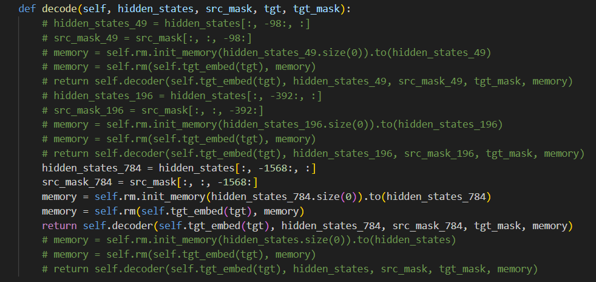
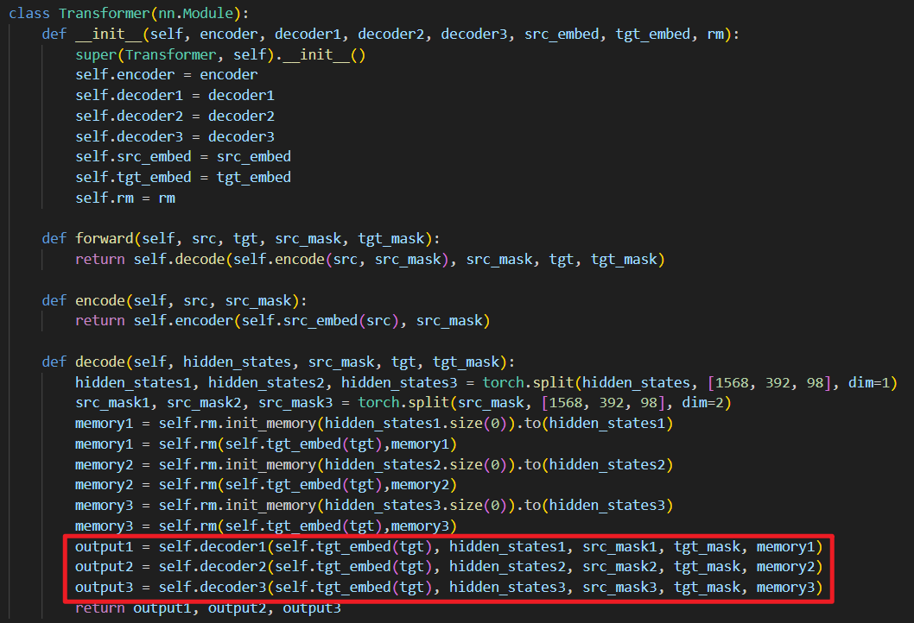
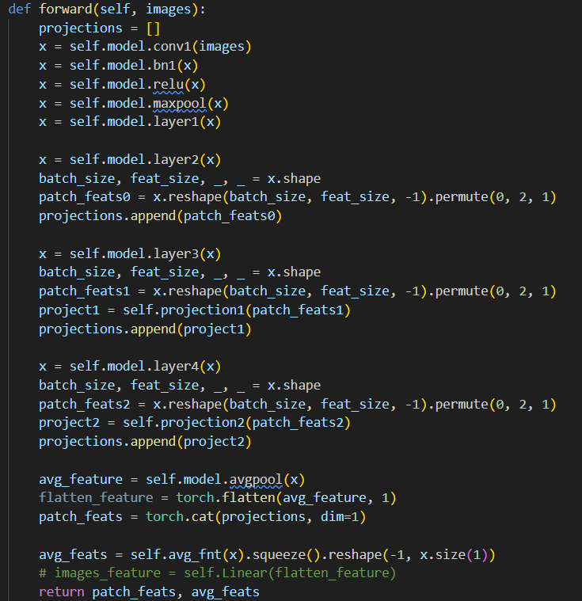

# R2Gen-multiscale

### Different from R2Gen

encoder_decoder.py

在multiscale中分别选取hidden——states最后49，196，784维训练decoder

encoder_decoder2.py

在multiscale中切分49，196，784维训练三个decoder

VisualExtractor_2.py

add multiscale

